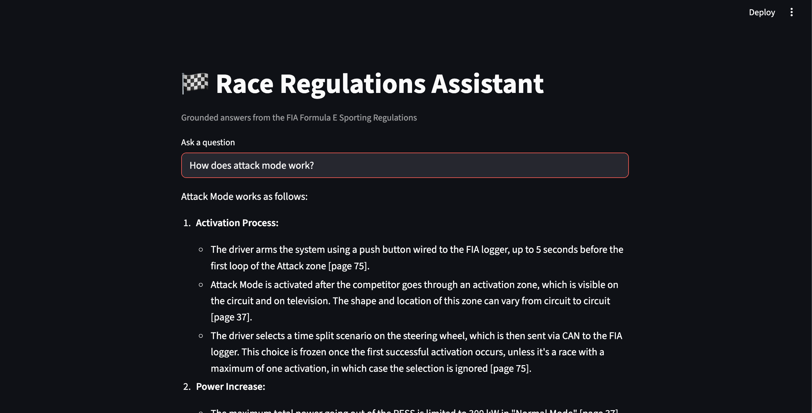

# Race Regulations RAG Assistant 🏁

Ask questions about the FIA Formula E Sporting Regulations and get grounded
answers with page-level citations — powered by a Retrieval-Augmented
Generation (RAG) pipeline built in Python with the Gemini API.

## Why this exists

Motorsport regulations are hundreds of pages of dense legal-technical text.
This assistant ingests the official regulations PDF, chunks it semantically,
embeds each chunk, and retrieves the most relevant passages at question time
so the LLM answers **from the document, with citations** — not from vibes.

## Architecture

```
regulations.pdf
     │  (1) ingest.py — extract text per page (pypdf)
     ▼
semantic chunks (~500 tokens, 80-token overlap, page numbers preserved)
     │  (2) Gemini embeddings (gemini-embedding-001), batched + cached
     ▼
vector store (numpy .npz — local prototype)
     │  (3) app.py — embed the question, cosine top-k retrieval
     ▼
Gemini generation with retrieved context → answer + [page N] citations
```

### Production path (GCP)

The local numpy store is deliberate for prototyping speed and zero cost.
The migration path to production on Google Cloud:

| Prototype | Production |
|---|---|
| numpy cosine search | **BigQuery Vector Search** or Vertex AI Vector Search |
| local .npz cache | BigQuery table with embedding column |
| API key auth | **IAM service account, least-privilege roles** |
| ad-hoc runs | Cloud Functions / Cloud Run endpoint |

### Cost guardrails (built in)

- Embeddings are **cached** (`.cache/embeddings.npz`) — re-running ingest
  never re-embeds unchanged chunks.
- Embedding calls are **batched** (100 chunks per request).
- Retrieval sends only top-k chunks to the generation model, keeping
  context (and cost) bounded.

## Setup

```bash
pip install -r requirements.txt
export GEMINI_API_KEY="your-key"   # aistudio.google.com/apikey

# 1. Download the current FIA Formula E Sporting Regulations PDF
#    from fiaformulae.com / fia.com and save as regulations.pdf

# 2. Ingest (chunk + embed + build the vector store)
python ingest.py regulations.pdf

# 3. Ask questions
python app.py "What happens if a driver exceeds the power limit?"

# Or run the UI
streamlit run app.py
```

## Example

> **Q:** How does Attack Mode work?


>
> **A:** Drivers must arm Attack Mode by driving through the designated
> activation zone off the racing line, granting a temporary power increase…
> *(Sources: page 42, page 43)*
